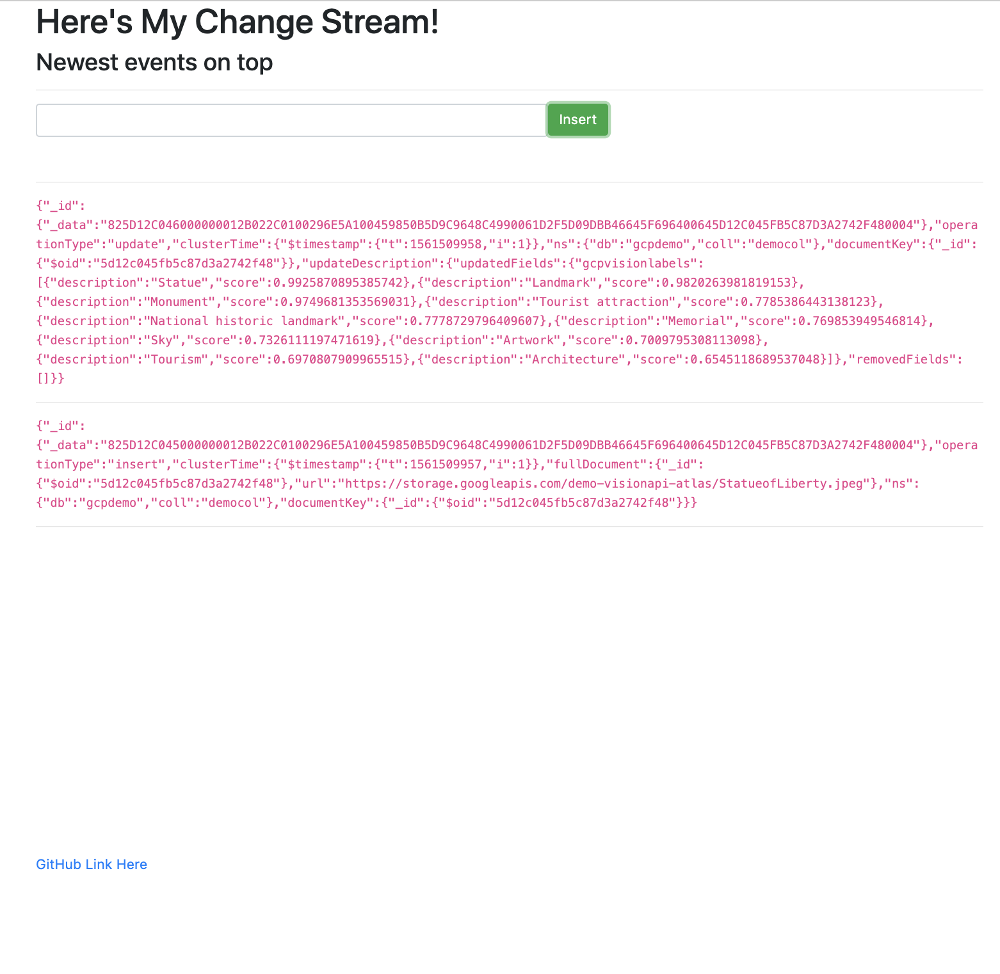

# GCP Instance Setup
* Create a micro Ubuntu 19.04 GCE VM instance in us-east4 using the instructions given here [link](https://www.google.com/url?q=https://cloud.google.com/compute/docs/quickstart-linux&sa=D&ust=1560383195254000)


* In the search box at the top, enter “Firewall” and select the matching suggestion "Firewall Rules VPC network”


* Click “Create Firewall Rule” at the top to create a new rule to open up the needed port for our new server


* Enter the following details and click “Create”:
```
Name: gcpatlasdemo
Targets: All instances in the network
Source IP ranges:  0.0.0.0/0
Protocols and ports:  
    tcp: 8088-8089
``` 


* In the top box, search for "Credentials" and choose the auto-complete option 

* In the search field up top, enter “compute engine” and select the suggestion: "Credentials APIs & Services"

* Click the blue "Create credentials" then choose "Service account key" in the list 

* Choose "new service account" and give it a name like atlasgcpdemo. For the scope, choose *what should i choose here?* and JSON format. Save and it will download the JSON file. Keep these contents for later.

* Go back to the Compute Engine page to list all VM instances.


* After your instance is created, SSH to your instance by clicking on the SSH button of your instance.


* You should see a CloudShell window similar to this open...


* Run the following commands:

```
  sudo apt-get update
  sudo apt-get install -y python3-pip
  sudo apt-get install -y git
  git clone https://github.com/graboskyc/MongoDBAtlas-GCP-AIML.git
  cd MongoDBAtlas-GCP-AIML/FinishedSampleCode
  python3 -m pip install -r requirements.txt
```

* Edit the `gcpcreds.json` to have the credentials of the json file you downloaded above
* Edit `settings.cfg` to have the Atlas connection string created above
* Run `python3 runner.py` to start the application
* Visit the URL of your server port 8088 and you should see a web page


