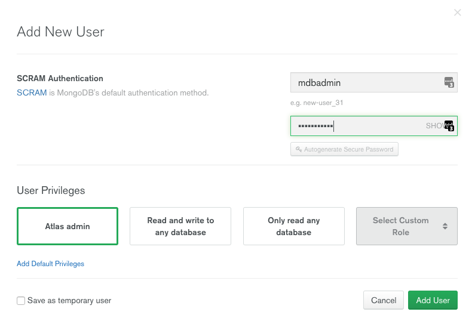
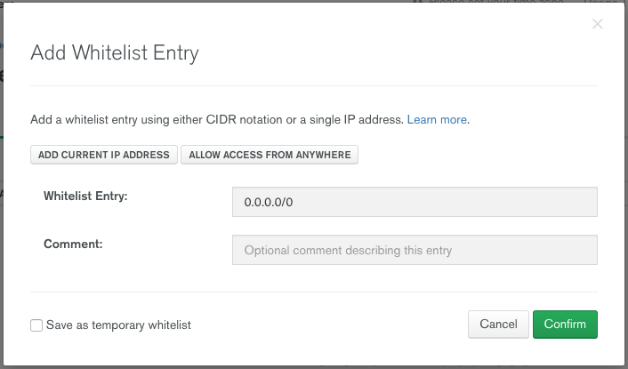
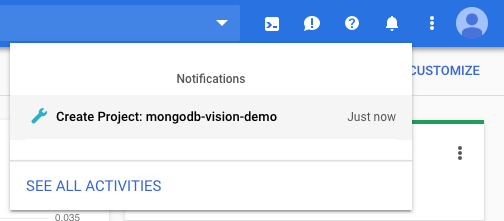
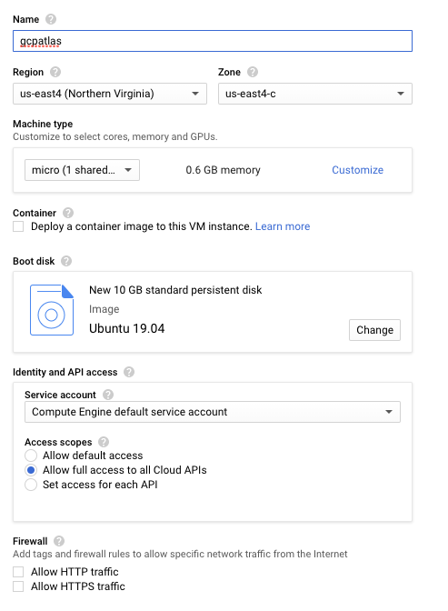
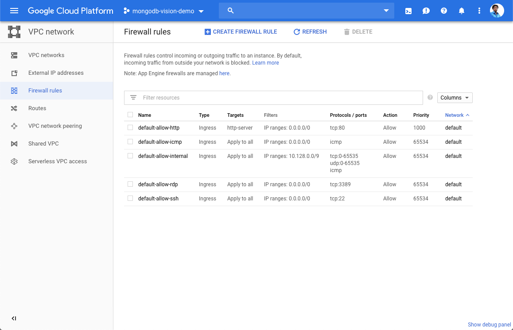
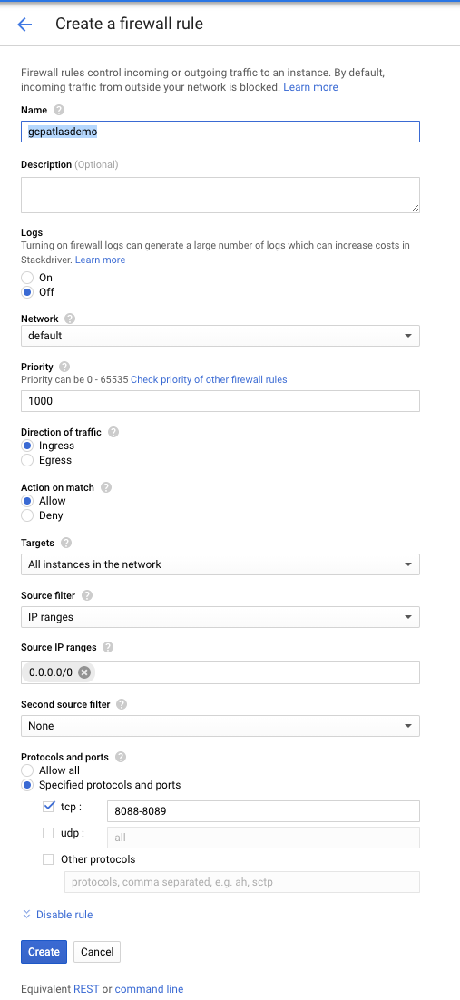
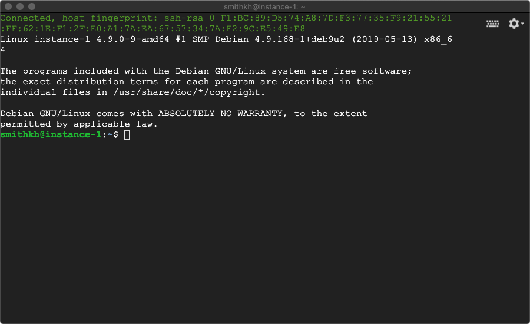

# MongoDBAtlas-GCP-AIML

## Background
This is a tutorial on how to use MongoDB Atlas in conjunction with Google Cloud Platform AI/ML APIs to create a event-driven model in Python.

This is part of a workshop series presented by MongoDB and Google Cloud. However it can also be done on its own.

### Technical Complexity

_Beginner_

### Duration

_45 Minutes_

## Setup
### MongoDB Setup
* Create a free account on MongoDB Atlas on [cloud.mongodb.com](https://cloud.mongodb.com) Click on “Try Free”at the top right if you do not have an account or “Sign In” if you already have a login. 


* Once on the MongoDB Atlas Homepage, select “Build a Cluster”


* Create New Cluster by selecting Google Cloud Platform as a “Cloud Provider” and leave all other settings as-is and click "Create Cluster" on the bottom right to deploy your M0 (free) cluster

* While this spins up, lets click on the “Database Access” submenu, under “Security” on the left menu. 


* Click the “Add New User” button on top right


* Enter a user name. For our demo, let’s enter `mdbadmin` and enter a secure password.  Record your user name and password in a safe location for reference later. Under “User Privileges”, select “Atlas admin” and click on the “Add User button to complete this section.



* Lets click on the “Network Access” submenu, under “Security” on the left menu. Click on “Add IP Address”.


* Select “Allow Access from Anywhere” for the purpose of this demo and click on “Confirm”.  

*Note*:  When actually putting something into production, you will want to narrow the scope of where your database can be accessed and specify a specific IP address/CIDR block.



* Go to “Clusters” submenu, under “Atlas” on the left menu. 

* Click on the "Collections" button and create a database called `gcpdemo` with a collection called `democol` 

* Go to “Clusters” submenu, under “Atlas” on the left menu. 

* Click on “Connect” button. A window will open. Select “Connect Your Application.” Choose Python and copy the connection string they give you. We will need this later.


### GCP Vision API Setup


* Go to cloud.google.com and login with your Google account. If you don't have a Google account, please create a free trial account by following instructions at this [link](https://console.cloud.google.com/freetrial).

* If not already there, go to https://console.cloud.google.com/

* Create a new project, by selecting the following dropdown in the top left:


* A new window will pop up.  In it, select "New Project" in the top right:


* Give your Vision API demo a new project name.  Let's go with “mongodb-vision-demo” and click the “Create” button:




* After your new project is done being created. Go back to the dropdown from before and select your new project name:


* When the right project is selected, the name will change to reflect this in the dropdown in the top left of your console:


* Get a credential and put it in `gcpcreds.json`

### GCP Instance Setup
* Create a micro Ubuntu 19.04 GCE VM instance in us-east4 using the instructions given here [link](https://www.google.com/url?q=https://cloud.google.com/compute/docs/quickstart-linux&sa=D&ust=1560383195254000)



* In the search box at the top, enter “Firewall” and select the matching suggestion "Firewall Rules VPC network”


* Click “Create Firewall Rule” at the top to create a new rule to open up the needed port for our new server



* Enter the following details and click “Create”:
```
Name: gcpatlasdemo
Targets: All instances in the network
Source IP ranges:  0.0.0.0/0
Protocols and ports:  
    tcp: 8088-8089
``` 


* In the top box, search for "Credentials" and choose the auto-complete option 

* In the search field up top, enter “compute engine” and select the suggestion: "Credentials APIs & Services"

* Click the blue "Create credentials" then choose "Service account key" in the list 

* Choose "new service account" and give it a name like atlasgcpdemo. For the scope, choose *what should i choose here?* and JSON format. Save and it will download the JSON file. Keep these contents for later.

* Go back to the Compute Engine page to list all VM instances.


* After your instance is created, SSH to your instance by clicking on the SSH button of your instance.


* You should see a CloudShell window similar to this open...



* Run the following commands:
  * `sudo apt-get update`
  * `sudo apt-get install python3-pip`
  * `git clone https://github.com/graboskyc/MongoDBAtlas-GCP-AIML.git`
  * `cd MongoDBAtlas-GCP-AIML`
  * `pip install -r requirements.txt`
* Edit the `gcpcreds.json` to have the credentials of the json file you downloaded above
* Edit `settings.cfg` to have the Atlas connection string created above
* Run `python2 runner.py` to start the application
* Visit the URL of your server port 8088 and you should see a web page


## Execution
* Insert a document into the database using MongoDB Compass or the new Data Explorer view in MongoDB Atlas which you can get to via the "Collections" button. The document you insert should have a field called `url` which is a full URL to an image.
* Alternately enter the URL into the web page directly and press the green "Insert" button
* Notice that in the web page and on the CLI output of the python script that it saw an insert
* Notice that after the insert, the change stream called the Google Vision API to see what is in it. Refresh the Compass or Atlas Data Explorer view and see the rich data structure of the GCP Vision API.


## Extra Credit
* Create a GCP Cloud Storage Bucket to host your own images

## Sample Data
Feel free to use the following URLs for execution:
1. https://storage.googleapis.com/demo-visionapi-atlas/StatueofLiberty.jpeg
2. https://storage.googleapis.com/demo-visionapi-atlas/crash1.jpg
3. https://storage.googleapis.com/demo-visionapi-atlas/nike_logo_30021.jpg
4. https://storage.googleapis.com/demo-visionapi-atlas/Marketing/eiffel-tower.jpg
5. https://storage.googleapis.com/demo-visionapi-atlas/Finance/check.jpg
