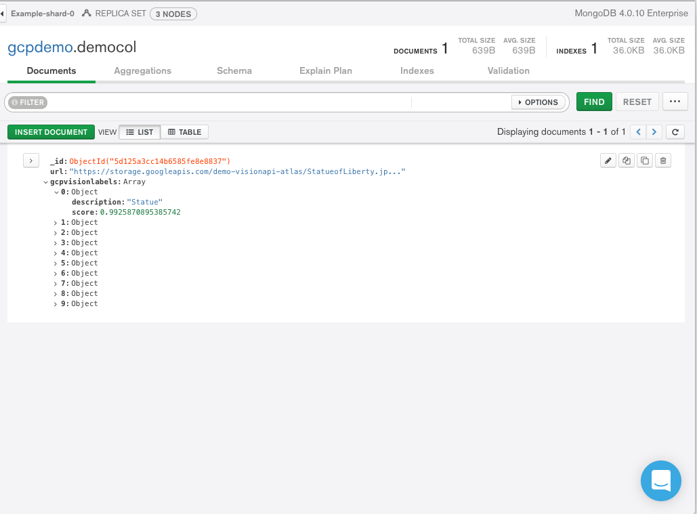

# MongoDBAtlas-GCP-AIML

## Background
This is a tutorial on how to use MongoDB Atlas in conjunction with Google Cloud Platform AI/ML APIs to create a event-driven model in Python.

This is part of a workshop series presented by MongoDB and Google Cloud. However it can also be done on its own.

### Technical Complexity

_Beginner_

### Duration

_45 Minutes_

## Setup
### High Level Readme
* Setup a MongoDB Atlas Account
* Deploy a MongoDB Atlas M0 (free tier)
* Configure the free tier to create a username/password and an IP whitelist to allow access from anywhere
* Make note of the connection string for Python
* Create a Google Cloud account
* Enable the Cloud Vision API
* Create a service credential and download the JSON file 
* Create a GCP instance
* Open firewall rules in GCP for ports 8088 and 8089 for this instance
* Install python, clone this github repo on to the host
* Configure the `FinishedSampleCode/settings.cfg` and `FinishedSampleCode/gcpcreds.cfg` to have the Atlas connection string and GCP credentials in them that you created earlier
* Install any python requirements by running `pip install -r FinishedSampleCode/requirements.txt`
* Start the application using `python3 FinishedSampleCode/runner.py`
* Open a web browser to the GCP instance running on port 8088 over http

### Low Level Readme
* [Readme for configuring MongoDB Atlas](Guides/AtlasSetup.md)
* [Readme for configuring GCP Vision API](Guides/GCPVisionSetup.md)
* [Readme for configuring the GCP Instance](Guides/GCPInstanceSetup.md)
* [Readme for writing this code from scratch](Guides/Code.md) or alternately just use the code in `FinishedSampleCode`

## Execution
* Open a web browser to the GCP instance running on port 8088 over http
* Insert a document into the database using MongoDB Compass or the new Data Explorer view in MongoDB Atlas which you can get to via the "Collections" button. The document you insert should have a field called `url` which is a full URL to an image.
* Alternately enter the URL into the web page directly and press the green "Insert" button
* Notice that in the web page and on the CLI output of the python script that it saw an insert
* Notice that after the insert, the change stream called the Google Vision API to see what is in it. Refresh the Compass or Atlas Data Explorer view and see the rich data structure of the GCP Vision API.

## Sample Data
Feel free to use the following URLs for execution:
1. https://storage.googleapis.com/demo-visionapi-atlas/StatueofLiberty.jpeg
2. https://storage.googleapis.com/demo-visionapi-atlas/crash1.jpg
3. https://storage.googleapis.com/demo-visionapi-atlas/nike_logo_30021.jpg
4. https://storage.googleapis.com/demo-visionapi-atlas/Marketing/eiffel-tower.jpg
5. https://storage.googleapis.com/demo-visionapi-atlas/Finance/check.jpg

## Extra Credit
* Create a GCP Cloud Storage Bucket to host your own images